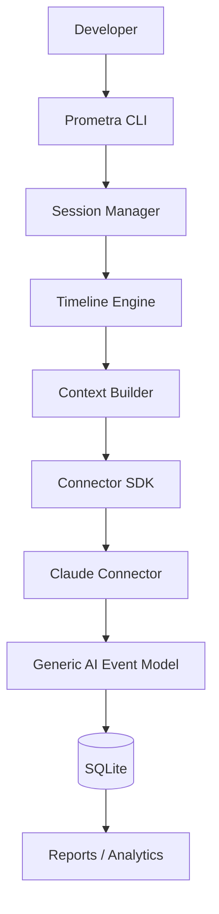

# Prometra

The Intelligence Layer for AI-Assisted Software Development.

[](https://www.python.org)
[](https://opensource.org/licenses/MIT)
[](tests/)
[]()

## Table of Contents

- [What is Prometra?](#what-is-prometra)
- [Architecture](#architecture)
- [Core Features](#core-features)
- [Installation](#installation)
- [Quick Start](#quick-start)
- [Connector System](#connector-system)
- [AI Event Model](#ai-event-model)
- [Project Structure](#project-structure)
- [Architecture Principles](#architecture-principles)
- [Development](#development)
- [Testing](#testing)
- [Roadmap](#roadmap)
- [Contributing](#contributing)
- [License](#license)

## What is Prometra?

Prometra is a local-first development intelligence platform that acts as the missing layer between your source control and your AI coding tools. While Git records the *history* of your code, Prometra records the *context* behind that history. 

By tracking filesystem changes, Git state, and AI interactions in real-time, Prometra builds a comprehensive, chronological timeline of your development sessions. This allows developers to audit exactly how AI-assisted software was built, analyze project health, and export detailed development intelligence reports without relying on cloud services.

## Architecture



## Core Features

| Feature | Description | Status |
|---------|-------------|--------|
| **Session Tracking** | Graceful lifecycle tracking of continuous development sessions. | ✅ Active |
| **Filesystem Tracking** | Real-time monitoring of file modifications, creations, and deletions. | ✅ Active |
| **Git Tracking** | Capture commits, branch states, and repository metadata. | ✅ Active |
| **SQLite Storage** | Local-first, schema-driven persistent storage. | ✅ Active |
| **Timeline Engine** | Chronological sequencing of all developer and AI actions. | ✅ Active |
| **Project Analytics** | Codebase health, risk level, and statistical insights. | ✅ Active |
| **Report Generation** | Multi-format (Markdown, HTML, JSON, CSV) intelligence reports. | ✅ Active |
| **Export System** | Compress and package project intelligence into portable `.zip` archives. | ✅ Active |
| **Connector SDK** | Extensible interface for integrating external AI tools. | ✅ Active |
| **Connector Registry** | Dynamic Python `entry_points` discovery for external plugins. | ✅ Active |
| **Context Engine** | Generates strict Pydantic context trees from raw SQLite history. | ✅ Active |
| **Event Bus** | Pub/Sub architecture for decoupling tracking from AI events. | ✅ Active |

## Installation

Clone the repository and install it in editable mode:

```bash
git clone https://github.com/<username>/Prometra.git
cd prometra
pip install -e .
```

Verify the installation by checking the application version and health:

```bash
prometra version
prometra doctor
```

## Quick Start

Prometra operates seamlessly alongside your existing workflow.

Initialize Prometra in your project:
```bash
prometra init
```

Start tracking a new development session:
```bash
prometra start
```

*... perform your coding tasks, commit via Git, and use your AI tools ...*

Stop the active session:
```bash
prometra stop
```

Review the chronological timeline of your session:
```bash
prometra timeline
```

Analyze the health of your project:
```bash
prometra analyze
```

Generate a comprehensive development report:
```bash
prometra report --format markdown
```

Review session history:
```bash
prometra history
```

## Connector System

Prometra Version 2 introduces a decoupled **Connector SDK** that allows external AI providers to interface with the core tracking engine without modifying base code.

- **Dynamic Discovery**: Connectors are auto-discovered via Python `entry_points`.
- **Connector CLI**: Manage connectors using `prometra connectors list`, `prometra connectors info <name>`, `prometra connectors enable <name>`, `prometra connectors disable <name>`, and `prometra connectors health`.
- **Validation**: Strict configuration and schema checks ensure plugins conform to Prometra standards using `prometra connectors validate`.

### Supported Connectors
- **Claude Code** (`claude`): The flagship implementation, dynamically tracking Anthropic's Claude Code CLI sessions.

*Future Connectors:* Codex, Gemini, Cursor.

## AI Event Model

To maintain a purely decoupled analytical core, Prometra enforces a **Provider-Agnostic Event Model**. All specialized events generated by external plugins pass through a Translation Layer before hitting the SQLite database. This ensures that the Timeline Engine, Analyzer, and Report Generators only ever consume standardized, generic AI schemas.

| Claude Event | Translates To |
|--------------|---------------|
| `ClaudeSessionStarted` | `SessionStarted` |
| `ClaudeSessionStopped` | `SessionEnded` |
| `ClaudeHealthChanged` | `ErrorOccurred` |

## Project Structure

```text
prometra/
├── prometra/
│   ├── ai/                 # Generic Event Model & Translators
│   ├── analyzer/           # Project Health & Statistics
│   ├── cli/                # Typer CLI Commands
│   ├── connectors/         # SDK, Registry, and Claude Implementation
│   ├── context/            # Context Builder Engine
│   ├── core/               # Configuration and Utilities
│   ├── reports/            # Markdown, HTML, CSV, JSON Exporters
│   ├── storage/            # SQLite Models and Engine
│   ├── timeline/           # Chronological Event Sequencing
│   └── tracker/            # Session, Filesystem, and Git Trackers
├── tests/                  # Pytest Suite
├── docs/                   # Documentation Artifacts
├── pyproject.toml          # Packaging and Entry Points
└── README.md
```

## Architecture Principles

- **Local-first**: All tracking, storage, and analysis run locally on your machine.
- **SOLID**: Strict adherence to single responsibility and interface segregation.
- **Dependency Injection**: Core components accept interfaces (e.g., SQLite storage) dynamically rather than hardcoding instantiations.
- **Plugin Architecture**: Extending Prometra requires zero core modifications due to the `entry_points` Connector Registry.
- **Provider-Agnostic Design**: Core systems only understand generic AI events, ensuring long-term maintainability.
- **Event-Driven Design**: The Event Bus decouples publishers (Filesystem, Git) from subscribers (Connectors).

## Development

Formatting and linting are maintained via `black` and `isort`.

```bash
# Install development dependencies
pip install -e ".[dev]"

# Format code
black prometra/ tests/
isort prometra/ tests/
```

## Testing

Prometra uses `pytest` for rigorous unit and integration testing. 

```bash
pytest tests/
```

**Current Status**: 21 tests passing

## Roadmap

**Current:**
- ✅ Version 1
- ✅ Connector SDK
- ✅ Claude Connector
- ✅ Generic AI Event Model

**Upcoming:**
- [ ] Interactive Timeline
- [ ] Session Replay
- [ ] Analytics Dashboard
- [ ] Prompt Search
- [ ] Diff Viewer
- [ ] VS Code Extension
- [ ] Codex Connector
- [ ] Gemini Connector
- [ ] Cursor Connector

## Contributing

We welcome contributions from the community! To get started:
1. Fork the repository.
2. Create a new feature branch (`git checkout -b feature/amazing-feature`).
3. Commit your changes.
4. Run the test suite (`pytest tests/`).
5. Open a Pull Request with a detailed description of your architectural decisions.

## License

MIT
