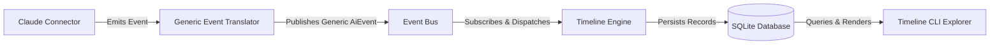
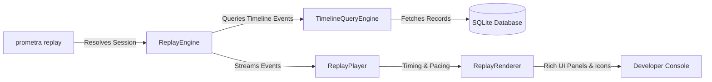
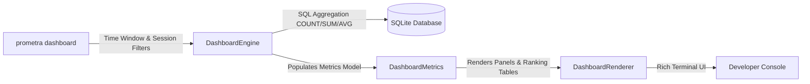

# Prometra Architecture

Prometra is a local-first development intelligence platform that bridges source control, filesystem activity, and AI coding interactions.

## End-to-End AI Event & Timeline Flow

## Session Replay Flow

## Analytics Dashboard Flow

### Core Architecture Components

1. **Storage Layer (`prometra/storage`)**: Uses SQLAlchemy mapped to a local SQLite database (`.prometra/prometra.db`). Maintains strict timezone-aware UTC schemas using `AwareDateTime`. Persists filesystem events, git events, timeline events, and detailed `AiEventModel` records.
2. **Trackers (`prometra/tracker`)**:
   - `FilesystemTracker`: Leverages `watchdog` to monitor recursive directory changes with debouncing.
   - `GitTracker`: Uses `GitPython` to poll the HEAD commit, extracting insertions, deletions, merges, and tags in real-time.
   - `SessionManager`: Handles graceful start, stop, and automated stale session recovery algorithms.
3. **AI Event System & Translators (`prometra/ai`)**:
   - Provider-agnostic `AiEvent` base models.
   - `EventTranslatorRegistry` converting connector-specific events into normalized AI event representations.
4. **Event Bus (`prometra/connectors/events.py`)**: Pub/sub architecture decoupling connectors from storage logic.
5. **Timeline Engine (`prometra/timeline`)**: Funnels filesystem, git, and AI event streams into a unified `TimelineEventModel` sequence.
6. **Session Replay Engine (`prometra/replay`)**: Reconstructs session history, playing back events at animated speeds (`1x`, `2x`, `5x`, `10x`, `instant`) or step-by-step mode (`--step`).
7. **Analytics Dashboard (`prometra/dashboard`)**: Executes SQL aggregations across sessions, file edits, git commits, and AI metrics to render actionable developer productivity dashboards.
8. **Analyzer & Reports (`prometra/analyzer`, `prometra/reports`)**: Formulates codebase health scores, dependency risk metrics, and multi-format reports.
